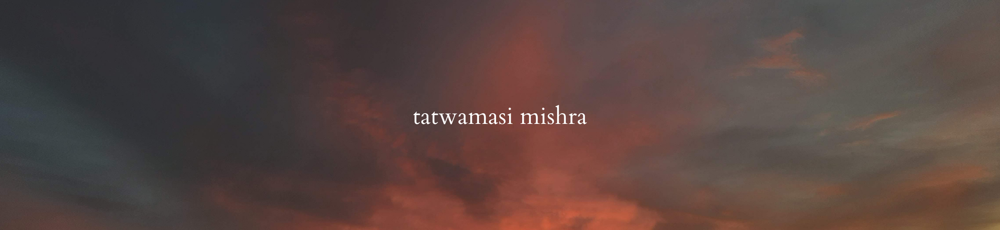

<!-- BANNER -->

<h1> Hi, I’m Tatwamasi!</h1>

👀 I’m interested in backend web development and data science.  
🌱 I’m currently learning Javascript-based backend technologies and exploring with the MERN stack!  
💞️ I’m looking to collaborate on projects using React, ExpressJS, vanilla JS or Python.  
🌈 Fun fact about me? I love sunsets and pretty skies. And dad jokes.  

Happy coding!

